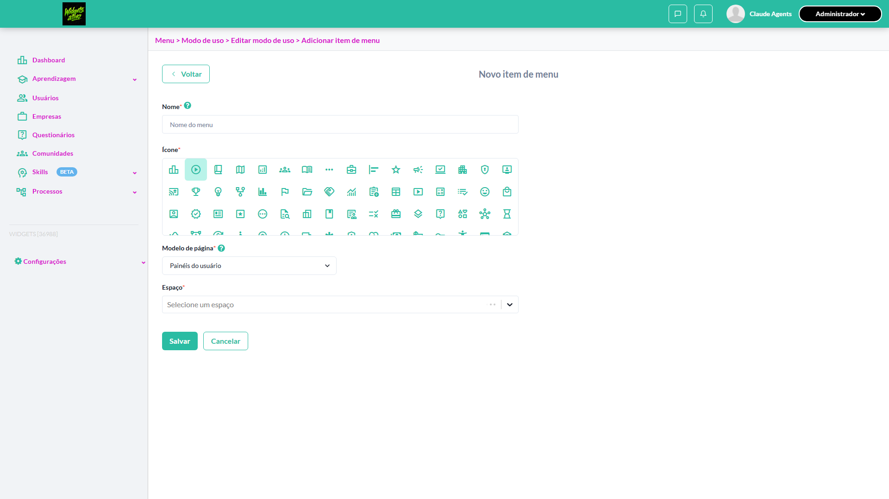
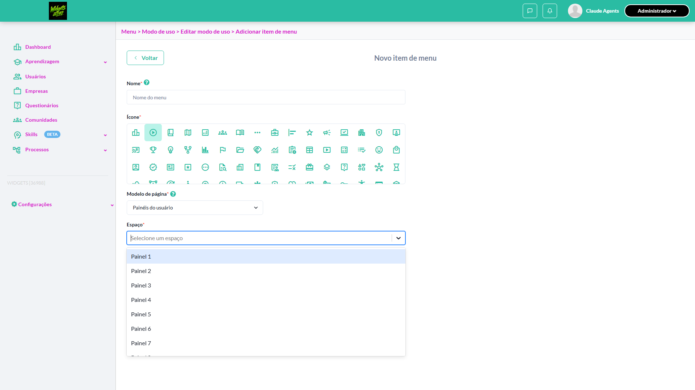
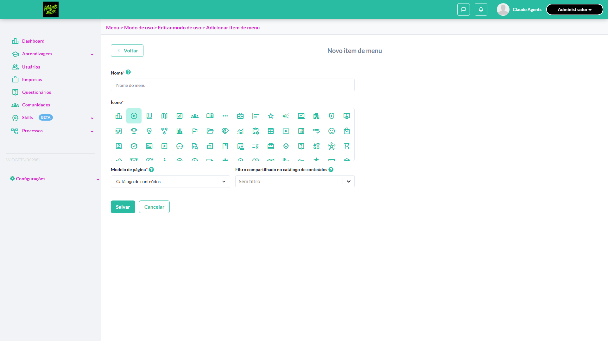
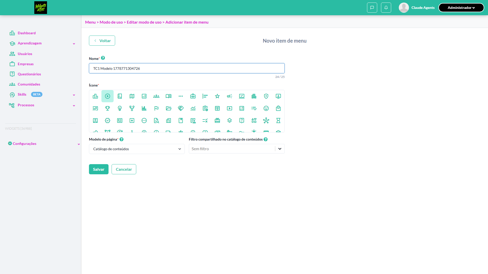
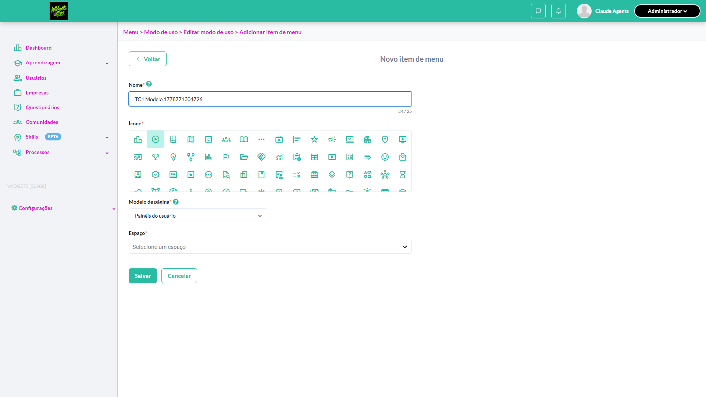
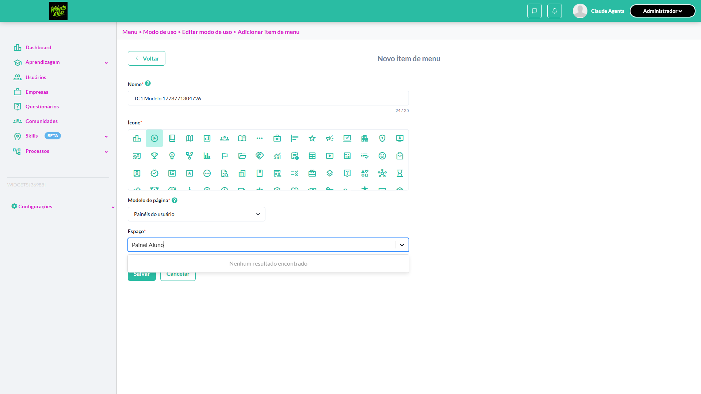

# Casos de teste — Widgets

[← Voltar ao dashboard](index.md)

Lista detalhada por testsuite. Cada caso traz: o que era esperado pelo XML, quais steps foram executados, evidências (screenshots/trace), texto pronto pra registro de bug e — quando houver falha — uma explicação em PT-BR do motivo.

## Modo de uso - Painéis do usuário

_3 caso(s) — 0 aprovado(s), 2 falha(s), 1 ignorado(s)_

### ❌ Falhou · TC2 · Listar painéis disponíveis no campo 'Espaço' · 🟡 Normal

<a id="listar-paineis-disponiveis-no-campo-espaco"></a>_Arquivo:_ `listar-paineis-campo-espaco.spec.ts` · _Duração:_ 14.74s · _Browser:_ chromium

> **❌ Por que falhou:** Error: expect(received).toBe(expected) // Object.is equality
> _Step impactado:_ **3. Abrir dropdown e validar opções (painel ativo aparece, inativos não)**

**Sumário (objetivo do caso):** Validar opções listadas no campo Espaço.

**Pré-condições:**

```
Ambiente Stage configurado Funcionalidade 'Gestão de Painéis' habilitada no contrato Feature flag 'habilitar_paineis_do_usuario' ativa Usuário logado como Admin Existem mais de 3 painéis ativos e outros inativos cadastrados
```

**Passos do caso (XML/TestLink + execução Playwright):**

_Cada linha reproduz um passo do XML; a coluna **Status** traz o resultado da execução (do step Allure correspondente). Linhas com "Pré-condição" são da execução automatizada (login, navegação inicial) — não fazem parte do roteiro do XML._

| # | Ação do passo | Resultado esperado | Status | Notas | Duração |
|---|---|---|:---:|---|---:|
| 1 | Acessar a configuração de um menu de modo de uso | Formulário é exibido | ✅ | — | 10.82s |
| 2 | Selecionar 'Painéis do usuário' no modelo de página | Campo 'Espaço' é exibido | ✅ | — | 0.33s |
| 3 | Abrir o dropdown 'Espaço' | Opções listadas correspondem aos painéis ativos disponíveis para a organização, confirmando que painéis inativos não são exibidos | ❌ | Error: expect(received).toBe(expected) // Object.is equality | 0.17s |

**Evidências:**

📁 _Pasta:_ [`artifacts/projects-widgets-tests-fea-bd646-isponíveis-no-campo-Espaço--chromium/`](artifacts/projects-widgets-tests-fea-bd646-isponíveis-no-campo-Espaço--chromium/)

- 📸 **Screenshot (step-01-1-Setup-navegar-ao-form-de-novo-item-de-menu)** — [`step-01-1-Setup-navegar-ao-form-de-novo-item-de-menu-5e51d1739ffd5c1cc1422eb4267644bc328dfea2.png`](artifacts/projects-widgets-tests-fea-bd646-isponíveis-no-campo-Espaço--chromium/step-01-1-Setup-navegar-ao-form-de-novo-item-de-menu-5e51d1739ffd5c1cc1422eb4267644bc328dfea2.png)

  

- 📸 **Screenshot (step-02-2-Selecionar-Pain-is-do-usu-rio-no-Modelo-de-p-gina-campo-Es)** — [`step-02-2-Selecionar-Pain-is-do-usu-rio-no-Modelo-de-p-gina-campo-Es-dc0e5fc5c00ee4b534fea0a169c83c68cff40496.png`](artifacts/projects-widgets-tests-fea-bd646-isponíveis-no-campo-Espaço--chromium/step-02-2-Selecionar-Pain-is-do-usu-rio-no-Modelo-de-p-gina-campo-Es-dc0e5fc5c00ee4b534fea0a169c83c68cff40496.png)

  

- 📸 **Screenshot (screenshot)** — [`test-failed-1.png`](artifacts/projects-widgets-tests-fea-bd646-isponíveis-no-campo-Espaço--chromium/test-failed-1.png)

  

- 🎬 [Vídeo da execução (video.webm)](artifacts/projects-widgets-tests-fea-bd646-isponíveis-no-campo-Espaço--chromium/video.webm)

- 🎬 [Vídeo da execução (video-1.webm)](artifacts/projects-widgets-tests-fea-bd646-isponíveis-no-campo-Espaço--chromium/video-1.webm)

- 📦 **Trace** — [`trace.zip`](artifacts/projects-widgets-tests-fea-bd646-isponíveis-no-campo-Espaço--chromium/trace.zip)

  ```bash
  npx playwright show-trace outputs/widgets/reports/modo-de-uso-paineis-do-usuario_20260514-120942/artifacts/projects-widgets-tests-fea-bd646-isponíveis-no-campo-Espaço--chromium/trace.zip
  ```

- 🎥 **Vídeo** — [`video.webm`](artifacts/projects-widgets-tests-fea-bd646-isponíveis-no-campo-Espaço--chromium/video.webm)

- 🎥 **Vídeo** — [`video-1.webm`](artifacts/projects-widgets-tests-fea-bd646-isponíveis-no-campo-Espaço--chromium/video-1.webm)

- 📄 **DOM no momento da falha** — [`error-context.md`](artifacts/projects-widgets-tests-fea-bd646-isponíveis-no-campo-Espaço--chromium/error-context.md)

#### 🐛 Pronto para registro de bug

**Descrição do BUG:** [Normal] Listar painéis disponíveis no campo 'Espaço' — Error: expect(received).toBe(expected) // Object.is equality

**Passo a passo para reprodução:**
1. Pré: Ambiente Stage configurado Funcionalidade 'Gestão de Painéis' habilitada no contrato Feature flag 'habilitar_paineis_do_usuario' ativa Usuário logado como Admin Existem mais de 3 painéis ativos e outros inativos cadastrados
1. 1. Acessar a configuração de um menu de modo de uso
1. 2. Selecionar 'Painéis do usuário' no modelo de página
1. 3. Abrir o dropdown 'Espaço'

**Comportamento esperado:** Opções listadas correspondem aos painéis ativos disponíveis para a organização, confirmando que painéis inativos não são exibidos

**Comportamento atual:** Error: expect(received).toBe(expected) // Object.is equality

**Informações:**

| Campo | Valor |
|---|---|
| URL | `https://widgets.stage.twygoead.com/` |
| Login | ${TWYGO_STAGING_WIDGETS_EMAIL} |
| Senha | ${TWYGO_STAGING_WIDGETS_PASSWORD} |
| orgId | 36988 |
| Outros | Browser: chromium |
| Outros | runId: modo-de-uso-paineis-do-usuario_20260514-120942 |
| Outros | Duração até a falha: 14.74s |
| Outros | Step impactado: 3. 3. Abrir dropdown e validar opções (painel ativo aparece, inativos não) |

**Evidências:**

- Screenshot capturado pelo Playwright (step-01-1-Setup-navegar-ao-form-de-novo-item-de-menu): artifacts/projects-widgets-tests-fea-bd646-isponíveis-no-campo-Espaço--chromium/step-01-1-Setup-navegar-ao-form-de-novo-item-de-menu-5e51d1739ffd5c1cc1422eb4267644bc328dfea2.png
- Screenshot capturado pelo Playwright (step-02-2-Selecionar-Pain-is-do-usu-rio-no-Modelo-de-p-gina-campo-Es): artifacts/projects-widgets-tests-fea-bd646-isponíveis-no-campo-Espaço--chromium/step-02-2-Selecionar-Pain-is-do-usu-rio-no-Modelo-de-p-gina-campo-Es-dc0e5fc5c00ee4b534fea0a169c83c68cff40496.png
- Screenshot capturado pelo Playwright (screenshot): artifacts/projects-widgets-tests-fea-bd646-isponíveis-no-campo-Espaço--chromium/test-failed-1.png
- Vídeo da execução (video-1.webm): artifacts/projects-widgets-tests-fea-bd646-isponíveis-no-campo-Espaço--chromium/video-1.webm
- Vídeo da execução (video.webm): artifacts/projects-widgets-tests-fea-bd646-isponíveis-no-campo-Espaço--chromium/video.webm
- Snapshot do DOM/contexto da página (error-context.md): artifacts/projects-widgets-tests-fea-bd646-isponíveis-no-campo-Espaço--chromium/error-context.md
- Trace completo do Playwright (.zip) — `npx playwright show-trace`: artifacts/projects-widgets-tests-fea-bd646-isponíveis-no-campo-Espaço--chromium/trace.zip

<details><summary>📋 Ver texto agregado para copiar (Jira/GitHub/Linear)</summary>

```
Descrição do BUG
[Normal] Listar painéis disponíveis no campo 'Espaço' — Error: expect(received).toBe(expected) // Object.is equality

Passo a passo para reprodução
  Pré: Ambiente Stage configurado Funcionalidade 'Gestão de Painéis' habilitada no contrato Feature flag 'habilitar_paineis_do_usuario' ativa Usuário logado como Admin Existem mais de 3 painéis ativos e outros inativos cadastrados
  1. Acessar a configuração de um menu de modo de uso
  2. Selecionar 'Painéis do usuário' no modelo de página
  3. Abrir o dropdown 'Espaço'

Comportamento esperado
Opções listadas correspondem aos painéis ativos disponíveis para a organização, confirmando que painéis inativos não são exibidos

Comportamento atual
Error: expect(received).toBe(expected) // Object.is equality

Informações
- URL: https://widgets.stage.twygoead.com/
- Login: ${TWYGO_STAGING_WIDGETS_EMAIL}
- Senha: ${TWYGO_STAGING_WIDGETS_PASSWORD}
- ID do ambiente (orgId): 36988
- Outros:
  - Browser: chromium
  - runId: modo-de-uso-paineis-do-usuario_20260514-120942
  - Duração até a falha: 14.74s
  - Step impactado: 3. 3. Abrir dropdown e validar opções (painel ativo aparece, inativos não)

Evidências
- Screenshot capturado pelo Playwright (step-01-1-Setup-navegar-ao-form-de-novo-item-de-menu): artifacts/projects-widgets-tests-fea-bd646-isponíveis-no-campo-Espaço--chromium/step-01-1-Setup-navegar-ao-form-de-novo-item-de-menu-5e51d1739ffd5c1cc1422eb4267644bc328dfea2.png
- Screenshot capturado pelo Playwright (step-02-2-Selecionar-Pain-is-do-usu-rio-no-Modelo-de-p-gina-campo-Es): artifacts/projects-widgets-tests-fea-bd646-isponíveis-no-campo-Espaço--chromium/step-02-2-Selecionar-Pain-is-do-usu-rio-no-Modelo-de-p-gina-campo-Es-dc0e5fc5c00ee4b534fea0a169c83c68cff40496.png
- Screenshot capturado pelo Playwright (screenshot): artifacts/projects-widgets-tests-fea-bd646-isponíveis-no-campo-Espaço--chromium/test-failed-1.png
- Vídeo da execução (video-1.webm): artifacts/projects-widgets-tests-fea-bd646-isponíveis-no-campo-Espaço--chromium/video-1.webm
- Vídeo da execução (video.webm): artifacts/projects-widgets-tests-fea-bd646-isponíveis-no-campo-Espaço--chromium/video.webm
- Snapshot do DOM/contexto da página (error-context.md): artifacts/projects-widgets-tests-fea-bd646-isponíveis-no-campo-Espaço--chromium/error-context.md
- Trace completo do Playwright (.zip) — `npx playwright show-trace`: artifacts/projects-widgets-tests-fea-bd646-isponíveis-no-campo-Espaço--chromium/trace.zip

Execução
- runId: modo-de-uso-paineis-do-usuario_20260514-120942
- environment.json: staging-widgets
- testsuite: Modo de uso - Painéis do usuário
- testcase: Listar painéis disponíveis no campo 'Espaço'

```

</details>

<details><summary>🔧 Stack trace técnica completa (para desenvolvedor)</summary>

```
Error: expect(received).toBe(expected) // Object.is equality

Expected: true
Received: false
```

</details>

---

### ⊘ Ignorado · TC3 · Não permitir reabilitar menu inativado quando 'Espaço' do 'Painel do usuário' inativo · 🔴 Crítico

<a id="nao-permitir-reabilitar-menu-inativado-quando-espaco-do-painel-do-usuario-inativo"></a>_Arquivo:_ `nao-reabilitar-menu-painel-inativo.spec.ts` · _Duração:_ 1.06s · _Browser:_ chromium

> **⊘ Por que foi ignorado:** Marcado para revisão (test.fixme): seed ausente: TC depende de painel inativo COM menu vinculado, mas o backend dispara 500 (title_for#NoMethodError em GET /panels/{id}/linked_menus) impedindo PATCH /change_status. Bug bloqueia ensureInactive() apenas em sessão automatizada (user 'Claude Agents'); manual passa. Ver bug_title_for_linked_menus.md.

**Sumário (objetivo do caso):** Validar que não permite reativar um 'Menu' cujo espaço tenha sido inativado. (RN 9

**Pré-condições:**

```
Ambiente Stage configurado Funcionalidade 'Gestão de Painéis' habilitada no contrato Feature flag 'habilitar_paineis_do_usuario' ativa Usuário logado como Admin Ter 1 painel ativo Criar um modo de uso com este painel ativo Confirmar que o menu de 'Painéis do usuário' esteja 'Habilitado' Salvar edições do modo de uso Desabilitar o menu de 'Painéis do usuário' Inativar o painel utilizado
```

**Passos do caso (XML/TestLink + execução Playwright):**

_Cada linha reproduz um passo do XML; a coluna **Status** traz o resultado da execução (do step Allure correspondente). Linhas com "Pré-condição" são da execução automatizada (login, navegação inicial) — não fazem parte do roteiro do XML._

| # | Ação do passo | Resultado esperado | Status | Notas | Duração |
|---|---|---|:---:|---|---:|
| 1 | Acessar a edição do modo de uso criado | Menus devem ser listados corretamente | ⊘ | Step não executado — Marcado para revisão (test.fixme): seed ausente: TC depende de painel inativo COM menu vinculado, mas o backend dispara 500 (title_for#NoMethodError em GET /panels/{id}/linked_menus) impedindo PATCH /change_status. Bug bloqueia ensureInactive() apenas em sessão automatizada (user 'Claude Agents'); manual passa. Ver bug_title_for_linked_menus.md. | — |
| 2 | Tentar habilitar o menu de 'Painéis do usuário' | Não deve permitir habilitar e deve exibir mensagem: "Painel está inativo e não pode ser reativado" | ⊘ | Step não executado — Marcado para revisão (test.fixme): seed ausente: TC depende de painel inativo COM menu vinculado, mas o backend dispara 500 (title_for#NoMethodError em GET /panels/{id}/linked_menus) impedindo PATCH /change_status. Bug bloqueia ensureInactive() apenas em sessão automatizada (user 'Claude Agents'); manual passa. Ver bug_title_for_linked_menus.md. | — |

**Evidências:**

📁 _Pasta:_ [`artifacts/projects-widgets-tests-fea-981b4-o-Painel-do-usuário-inativo-chromium/`](artifacts/projects-widgets-tests-fea-981b4-o-Painel-do-usuário-inativo-chromium/)

- 📸 **Screenshot (screenshot)** — [`test-finished-1.png`](artifacts/projects-widgets-tests-fea-981b4-o-Painel-do-usuário-inativo-chromium/test-finished-1.png)

  

- 🎬 [Vídeo da execução (video.webm)](artifacts/projects-widgets-tests-fea-981b4-o-Painel-do-usuário-inativo-chromium/video.webm)

- 🎬 [Vídeo da execução (video-1.webm)](artifacts/projects-widgets-tests-fea-981b4-o-Painel-do-usuário-inativo-chromium/video-1.webm)

- 📦 **Trace** — [`trace.zip`](artifacts/projects-widgets-tests-fea-981b4-o-Painel-do-usuário-inativo-chromium/trace.zip)

  ```bash
  npx playwright show-trace outputs/widgets/reports/modo-de-uso-paineis-do-usuario_20260514-120942/artifacts/projects-widgets-tests-fea-981b4-o-Painel-do-usuário-inativo-chromium/trace.zip
  ```

- 🎥 **Vídeo** — [`video.webm`](artifacts/projects-widgets-tests-fea-981b4-o-Painel-do-usuário-inativo-chromium/video.webm)

- 🎥 **Vídeo** — [`video-1.webm`](artifacts/projects-widgets-tests-fea-981b4-o-Painel-do-usuário-inativo-chromium/video-1.webm)

#### ⏳ Pendente — execução automatizada não realizada

- **Severidade do caso (XML):** Crítico
- **Motivo do skip / fixme:** seed ausente: TC depende de painel inativo COM menu vinculado, mas o backend dispara 500 (title_for#NoMethodError em GET /panels/{id}/linked_menus) impedindo PATCH /change_status. Bug bloqueia ensureInactive() apenas em sessão automatizada (user 'Claude Agents'); manual passa. Ver bug_title_for_linked_menus.md.

**Roteiro do XML (para validação manual):**
1. Pré: Ambiente Stage configurado Funcionalidade 'Gestão de Painéis' habilitada no contrato Feature flag 'habilitar_paineis_do_usuario' ativa Usuário logado como Admin Ter 1 painel ativo Criar um modo de uso com este painel ativo Confirmar que o menu de 'Painéis do usuário' esteja 'Habilitado' Salvar edições do modo de uso Desabilitar o menu de 'Painéis do usuário' Inativar o painel utilizado
1. 1. Acessar a edição do modo de uso criado
1. 2. Tentar habilitar o menu de 'Painéis do usuário'

> Esse caso não bloqueia a build, mas precisa de validação manual ou ajuste no agente.


---

### ❌ Falhou · TC1 · Selecionar 'Painéis do usuário' como modelo de página no modo de uso · 🔴 Crítico

<a id="selecionar-paineis-do-usuario-como-modelo-de-pagina-no-modo-de-uso"></a>_Arquivo:_ `selecionar-paineis-usuario-modelo-pagina.spec.ts` · _Duração:_ 49.88s · _Browser:_ chromium

> **❌ Por que falhou:** Não foi possível clicar o elemento — ele não ficou disponível em 30s (locator: locator('[id^="react-select-"][id$="-option-0"]').first()).
> _Step impactado:_ **4. Escolher 'Painel Aluno' no campo Espaço e salvar**

**Sumário (objetivo do caso):** Validar seleção do modelo e exibição do campo Espaço (R11 RN88).

**Pré-condições:**

```
Ambiente Stage configurado Funcionalidade 'Gestão de Painéis' habilitada no contrato Feature flag 'habilitar_paineis_do_usuario' ativa Usuário logado como Admin Existe painel 'Painel Aluno' ativo cadastrado
```

**Passos do caso (XML/TestLink + execução Playwright):**

_Cada linha reproduz um passo do XML; a coluna **Status** traz o resultado da execução (do step Allure correspondente). Linhas com "Pré-condição" são da execução automatizada (login, navegação inicial) — não fazem parte do roteiro do XML._

| # | Ação do passo | Resultado esperado | Status | Notas | Duração |
|---|---|---|:---:|---|---:|
| 1 | Acessar Configurações > Menu > Modos de uso | Tela de Modos de uso é exibida | ✅ | — | 10.05s |
| 2 | Acessar a configuração de um menu existente (ou criar novo) | Formulário de configuração é exibido | ✅ | — | 0.26s |
| 3 | Ao adicionar menu, selecionar 'Painéis do usuário' no modelo de página | Campo 'Espaço' é exibido para selecionar o painel | ✅ | — | 0.42s |
| 4 | Selecionar 'Painel Aluno' no campo 'Espaço' | Painel é selecionado e configuração é salva | ❌ | Não foi possível clicar o elemento — ele não ficou disponível em 30s (locator: locator('[id^="react-select-"][id$="-option-0"]').first()). | 30.25s |

**Evidências:**

📁 _Pasta:_ [`artifacts/projects-widgets-tests-fea-c0faa-lo-de-página-no-modo-de-uso-chromium/`](artifacts/projects-widgets-tests-fea-c0faa-lo-de-página-no-modo-de-uso-chromium/)

- 📸 **Screenshot (step-01-1-Setup-navegar-ao-form-de-novo-item-de-menu)** — [`step-01-1-Setup-navegar-ao-form-de-novo-item-de-menu-11c5d3438424ff1a908ad1df5d40eecb41d9ce81.png`](artifacts/projects-widgets-tests-fea-c0faa-lo-de-página-no-modo-de-uso-chromium/step-01-1-Setup-navegar-ao-form-de-novo-item-de-menu-11c5d3438424ff1a908ad1df5d40eecb41d9ce81.png)

  

- 📸 **Screenshot (step-02-2-Preencher-Nome-do-menu)** — [`step-02-2-Preencher-Nome-do-menu-13ad4ea31bfd30ef9987c1e09239851e5b57b621.png`](artifacts/projects-widgets-tests-fea-c0faa-lo-de-página-no-modo-de-uso-chromium/step-02-2-Preencher-Nome-do-menu-13ad4ea31bfd30ef9987c1e09239851e5b57b621.png)

  

- 📸 **Screenshot (step-03-3-Selecionar-Pain-is-do-usu-rio-no-Modelo-de-p-gina)** — [`step-03-3-Selecionar-Pain-is-do-usu-rio-no-Modelo-de-p-gina-c4bc557d5e8efc485cf40f81b08b02cb6620e2e0.png`](artifacts/projects-widgets-tests-fea-c0faa-lo-de-página-no-modo-de-uso-chromium/step-03-3-Selecionar-Pain-is-do-usu-rio-no-Modelo-de-p-gina-c4bc557d5e8efc485cf40f81b08b02cb6620e2e0.png)

  

- 📸 **Screenshot (screenshot)** — [`test-failed-1.png`](artifacts/projects-widgets-tests-fea-c0faa-lo-de-página-no-modo-de-uso-chromium/test-failed-1.png)

  

- 🎬 [Vídeo da execução (video.webm)](artifacts/projects-widgets-tests-fea-c0faa-lo-de-página-no-modo-de-uso-chromium/video.webm)

- 🎬 [Vídeo da execução (video-1.webm)](artifacts/projects-widgets-tests-fea-c0faa-lo-de-página-no-modo-de-uso-chromium/video-1.webm)

- 📦 **Trace** — [`trace.zip`](artifacts/projects-widgets-tests-fea-c0faa-lo-de-página-no-modo-de-uso-chromium/trace.zip)

  ```bash
  npx playwright show-trace outputs/widgets/reports/modo-de-uso-paineis-do-usuario_20260514-120942/artifacts/projects-widgets-tests-fea-c0faa-lo-de-página-no-modo-de-uso-chromium/trace.zip
  ```

- 🎥 **Vídeo** — [`video.webm`](artifacts/projects-widgets-tests-fea-c0faa-lo-de-página-no-modo-de-uso-chromium/video.webm)

- 🎥 **Vídeo** — [`video-1.webm`](artifacts/projects-widgets-tests-fea-c0faa-lo-de-página-no-modo-de-uso-chromium/video-1.webm)

- 📄 **DOM no momento da falha** — [`error-context.md`](artifacts/projects-widgets-tests-fea-c0faa-lo-de-página-no-modo-de-uso-chromium/error-context.md)

#### 🐛 Pronto para registro de bug

**Descrição do BUG:** [Crítico] Selecionar 'Painéis do usuário' como modelo de página no modo de uso — Não foi possível clicar o elemento — ele não ficou disponível em 30s (locator: locator('[id^="react-select-"][id$="-option-0"]').first()).

**Passo a passo para reprodução:**
1. Pré: Ambiente Stage configurado Funcionalidade 'Gestão de Painéis' habilitada no contrato Feature flag 'habilitar_paineis_do_usuario' ativa Usuário logado como Admin Existe painel 'Painel Aluno' ativo cadastrado
1. 1. Acessar Configurações > Menu > Modos de uso
1. 2. Acessar a configuração de um menu existente (ou criar novo)
1. 3. Ao adicionar menu, selecionar 'Painéis do usuário' no modelo de página
1. 4. Selecionar 'Painel Aluno' no campo 'Espaço'

**Comportamento esperado:** Painel é selecionado e configuração é salva

**Comportamento atual:** Não foi possível clicar o elemento — ele não ficou disponível em 30s (locator: locator('[id^="react-select-"][id$="-option-0"]').first()).

**Informações:**

| Campo | Valor |
|---|---|
| URL | `https://widgets.stage.twygoead.com/` |
| Login | ${TWYGO_STAGING_WIDGETS_EMAIL} |
| Senha | ${TWYGO_STAGING_WIDGETS_PASSWORD} |
| orgId | 36988 |
| Outros | Browser: chromium |
| Outros | runId: modo-de-uso-paineis-do-usuario_20260514-120942 |
| Outros | Duração até a falha: 49.88s |
| Outros | Step impactado: 4. 4. Escolher 'Painel Aluno' no campo Espaço e salvar |

**Evidências:**

- Screenshot capturado pelo Playwright (step-01-1-Setup-navegar-ao-form-de-novo-item-de-menu): artifacts/projects-widgets-tests-fea-c0faa-lo-de-página-no-modo-de-uso-chromium/step-01-1-Setup-navegar-ao-form-de-novo-item-de-menu-11c5d3438424ff1a908ad1df5d40eecb41d9ce81.png
- Screenshot capturado pelo Playwright (step-02-2-Preencher-Nome-do-menu): artifacts/projects-widgets-tests-fea-c0faa-lo-de-página-no-modo-de-uso-chromium/step-02-2-Preencher-Nome-do-menu-13ad4ea31bfd30ef9987c1e09239851e5b57b621.png
- Screenshot capturado pelo Playwright (step-03-3-Selecionar-Pain-is-do-usu-rio-no-Modelo-de-p-gina): artifacts/projects-widgets-tests-fea-c0faa-lo-de-página-no-modo-de-uso-chromium/step-03-3-Selecionar-Pain-is-do-usu-rio-no-Modelo-de-p-gina-c4bc557d5e8efc485cf40f81b08b02cb6620e2e0.png
- Screenshot capturado pelo Playwright (screenshot): artifacts/projects-widgets-tests-fea-c0faa-lo-de-página-no-modo-de-uso-chromium/test-failed-1.png
- Vídeo da execução (video-1.webm): artifacts/projects-widgets-tests-fea-c0faa-lo-de-página-no-modo-de-uso-chromium/video-1.webm
- Vídeo da execução (video.webm): artifacts/projects-widgets-tests-fea-c0faa-lo-de-página-no-modo-de-uso-chromium/video.webm
- Snapshot do DOM/contexto da página (error-context.md): artifacts/projects-widgets-tests-fea-c0faa-lo-de-página-no-modo-de-uso-chromium/error-context.md
- Trace completo do Playwright (.zip) — `npx playwright show-trace`: artifacts/projects-widgets-tests-fea-c0faa-lo-de-página-no-modo-de-uso-chromium/trace.zip

<details><summary>📋 Ver texto agregado para copiar (Jira/GitHub/Linear)</summary>

```
Descrição do BUG
[Crítico] Selecionar 'Painéis do usuário' como modelo de página no modo de uso — Não foi possível clicar o elemento — ele não ficou disponível em 30s (locator: locator('[id^="react-select-"][id$="-option-0"]').first()).

Passo a passo para reprodução
  Pré: Ambiente Stage configurado Funcionalidade 'Gestão de Painéis' habilitada no contrato Feature flag 'habilitar_paineis_do_usuario' ativa Usuário logado como Admin Existe painel 'Painel Aluno' ativo cadastrado
  1. Acessar Configurações > Menu > Modos de uso
  2. Acessar a configuração de um menu existente (ou criar novo)
  3. Ao adicionar menu, selecionar 'Painéis do usuário' no modelo de página
  4. Selecionar 'Painel Aluno' no campo 'Espaço'

Comportamento esperado
Painel é selecionado e configuração é salva

Comportamento atual
Não foi possível clicar o elemento — ele não ficou disponível em 30s (locator: locator('[id^="react-select-"][id$="-option-0"]').first()).

Informações
- URL: https://widgets.stage.twygoead.com/
- Login: ${TWYGO_STAGING_WIDGETS_EMAIL}
- Senha: ${TWYGO_STAGING_WIDGETS_PASSWORD}
- ID do ambiente (orgId): 36988
- Outros:
  - Browser: chromium
  - runId: modo-de-uso-paineis-do-usuario_20260514-120942
  - Duração até a falha: 49.88s
  - Step impactado: 4. 4. Escolher 'Painel Aluno' no campo Espaço e salvar

Evidências
- Screenshot capturado pelo Playwright (step-01-1-Setup-navegar-ao-form-de-novo-item-de-menu): artifacts/projects-widgets-tests-fea-c0faa-lo-de-página-no-modo-de-uso-chromium/step-01-1-Setup-navegar-ao-form-de-novo-item-de-menu-11c5d3438424ff1a908ad1df5d40eecb41d9ce81.png
- Screenshot capturado pelo Playwright (step-02-2-Preencher-Nome-do-menu): artifacts/projects-widgets-tests-fea-c0faa-lo-de-página-no-modo-de-uso-chromium/step-02-2-Preencher-Nome-do-menu-13ad4ea31bfd30ef9987c1e09239851e5b57b621.png
- Screenshot capturado pelo Playwright (step-03-3-Selecionar-Pain-is-do-usu-rio-no-Modelo-de-p-gina): artifacts/projects-widgets-tests-fea-c0faa-lo-de-página-no-modo-de-uso-chromium/step-03-3-Selecionar-Pain-is-do-usu-rio-no-Modelo-de-p-gina-c4bc557d5e8efc485cf40f81b08b02cb6620e2e0.png
- Screenshot capturado pelo Playwright (screenshot): artifacts/projects-widgets-tests-fea-c0faa-lo-de-página-no-modo-de-uso-chromium/test-failed-1.png
- Vídeo da execução (video-1.webm): artifacts/projects-widgets-tests-fea-c0faa-lo-de-página-no-modo-de-uso-chromium/video-1.webm
- Vídeo da execução (video.webm): artifacts/projects-widgets-tests-fea-c0faa-lo-de-página-no-modo-de-uso-chromium/video.webm
- Snapshot do DOM/contexto da página (error-context.md): artifacts/projects-widgets-tests-fea-c0faa-lo-de-página-no-modo-de-uso-chromium/error-context.md
- Trace completo do Playwright (.zip) — `npx playwright show-trace`: artifacts/projects-widgets-tests-fea-c0faa-lo-de-página-no-modo-de-uso-chromium/trace.zip

Execução
- runId: modo-de-uso-paineis-do-usuario_20260514-120942
- environment.json: staging-widgets
- testsuite: Modo de uso - Painéis do usuário
- testcase: Selecionar 'Painéis do usuário' como modelo de página no modo de uso

```

</details>

<details><summary>🔧 Stack trace técnica completa (para desenvolvedor)</summary>

```
TimeoutError: locator.click: Timeout 30000ms exceeded.
Call log:
  - waiting for locator('[id^="react-select-"][id$="-option-0"]').first()

```

</details>

---
