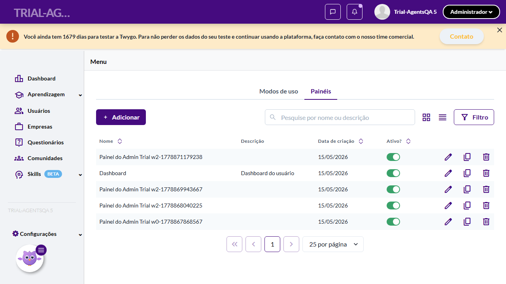
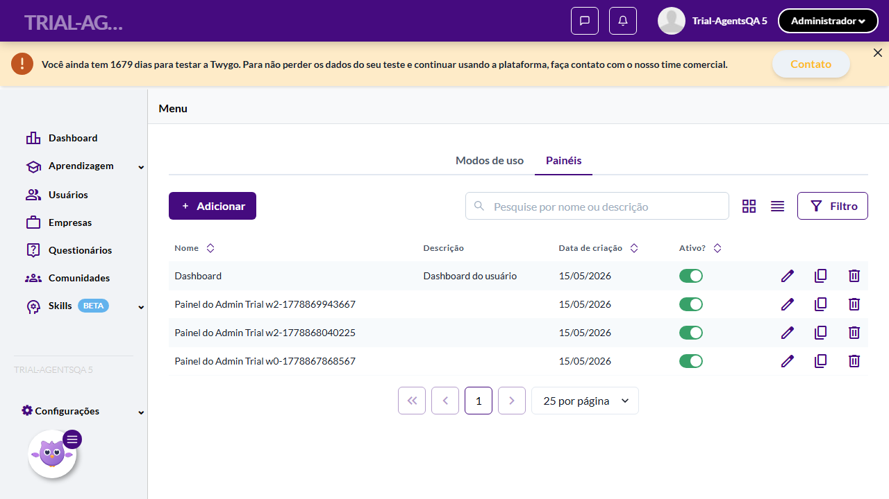
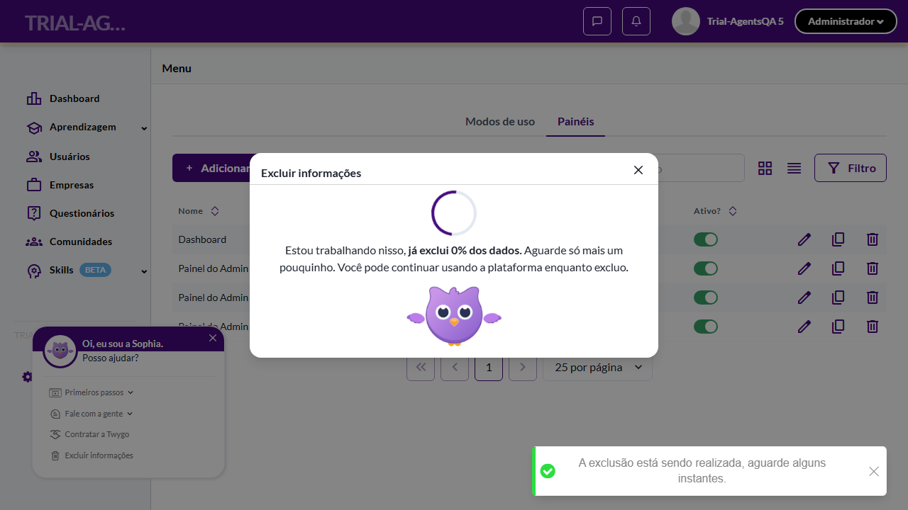

# Casos de teste — Widgets

[← Voltar ao dashboard](index.md)

Lista detalhada por testsuite. Cada caso traz: o que era esperado pelo XML, quais steps foram executados, evidências (screenshots/trace), texto pronto pra registro de bug e — quando houver falha — uma explicação em PT-BR do motivo.

## Trial

_4 caso(s) — 0 aprovado(s), 2 falha(s), 2 ignorado(s)_

### ⊘ Ignorado · TC2 · Criação de trial via API com painéis pré-definidos · 🔴 Crítico

<a id="criacao-de-trial-via-api-com-paineis-pre-definidos"></a>_Arquivo:_ `criacao-trial-api-paineis-predefinidos.spec.ts` · _Duração:_ 1.41s · _Browser:_ chromium

> **⊘ Por que foi ignorado:** Marcado para revisão (test.fixme): Override do XML: criação de trial via API substituída por wizard `/new/register/steps` (TC1) executado pelo playbook `provisionar-trial-projeto-twygo`. Decisão time QA Twygo 2026-05-15: API endpoint `external_onboarding` fica fora do escopo Playwright até existir API test suite dedicada (sem prazo).

**Sumário (objetivo do caso):** Validar inclusão via API.

**Pré-condições:**

```
Ambiente Stage configurado Token de acesso válido para 'https://stage.twygo.com/api/v2/external_onboarding'
```

**Passos do caso (XML/TestLink + execução Playwright):**

_Cada linha reproduz um passo do XML; a coluna **Status** traz o resultado da execução (do step Allure correspondente). Linhas com "Pré-condição" são da execução automatizada (login, navegação inicial) — não fazem parte do roteiro do XML._

| # | Ação do passo | Resultado esperado | Status | Notas | Duração |
|---|---|---|:---:|---|---:|
| 1 | Enviar POST 'https://stage.twygo.com/api/v2/external_onboarding' com payload de criação de trial | API responde com status 201/200 e cria o trial | ⊘ | Step não executado — Marcado para revisão (test.fixme): Override do XML: criação de trial via API substituída por wizard `/new/register/steps` (TC1) executado pelo playbook `provisionar-trial-projeto-twygo`. Decisão time QA Twygo 2026-05-15: API endpoint `external_onboarding` fica fora do escopo Playwright até existir API test suite dedicada (sem prazo). | — |
| 2 | Realizar login no trial criado como Admin | Usuário acessa o trial | ⊘ | Step não executado — Marcado para revisão (test.fixme): Override do XML: criação de trial via API substituída por wizard `/new/register/steps` (TC1) executado pelo playbook `provisionar-trial-projeto-twygo`. Decisão time QA Twygo 2026-05-15: API endpoint `external_onboarding` fica fora do escopo Playwright até existir API test suite dedicada (sem prazo). | — |
| 3 | Acessar a aba 'Painéis' | Listagem exibe os painéis pré-definidos do trial<br /> E também os demais painéis criados na base cópia | ⊘ | Step não executado — Marcado para revisão (test.fixme): Override do XML: criação de trial via API substituída por wizard `/new/register/steps` (TC1) executado pelo playbook `provisionar-trial-projeto-twygo`. Decisão time QA Twygo 2026-05-15: API endpoint `external_onboarding` fica fora do escopo Playwright até existir API test suite dedicada (sem prazo). | — |
| 4 | Acessar o menu de painéis como aluno do novo ambiente | Menu é acessado com sucesso | ⊘ | Step não executado — Marcado para revisão (test.fixme): Override do XML: criação de trial via API substituída por wizard `/new/register/steps` (TC1) executado pelo playbook `provisionar-trial-projeto-twygo`. Decisão time QA Twygo 2026-05-15: API endpoint `external_onboarding` fica fora do escopo Playwright até existir API test suite dedicada (sem prazo). | — |

**Evidências:**

📁 _Pasta:_ [`artifacts/projects-widgets-tests-fea-c77b9-I-com-painéis-pré-definidos-chromium/`](artifacts/projects-widgets-tests-fea-c77b9-I-com-painéis-pré-definidos-chromium/)

- 📸 **Screenshot (screenshot)** — [`test-finished-1.png`](artifacts/projects-widgets-tests-fea-c77b9-I-com-painéis-pré-definidos-chromium/test-finished-1.png)

  

- 🎬 [Vídeo da execução (video.webm)](artifacts/projects-widgets-tests-fea-c77b9-I-com-painéis-pré-definidos-chromium/video.webm)

- 🎬 [Vídeo da execução (video-1.webm)](artifacts/projects-widgets-tests-fea-c77b9-I-com-painéis-pré-definidos-chromium/video-1.webm)

- 📦 **Trace** — [`trace.zip`](artifacts/projects-widgets-tests-fea-c77b9-I-com-painéis-pré-definidos-chromium/trace.zip)

  ```bash
  npx playwright show-trace outputs/widgets/reports/trial_20260515-155439/artifacts/projects-widgets-tests-fea-c77b9-I-com-painéis-pré-definidos-chromium/trace.zip
  ```

- 🎥 **Vídeo** — [`video.webm`](artifacts/projects-widgets-tests-fea-c77b9-I-com-painéis-pré-definidos-chromium/video.webm)

- 🎥 **Vídeo** — [`video-1.webm`](artifacts/projects-widgets-tests-fea-c77b9-I-com-painéis-pré-definidos-chromium/video-1.webm)

#### ⏳ Pendente — execução automatizada não realizada

- **Severidade do caso (XML):** Crítico
- **Motivo do skip / fixme:** Override do XML: criação de trial via API substituída por wizard `/new/register/steps` (TC1) executado pelo playbook `provisionar-trial-projeto-twygo`. Decisão time QA Twygo 2026-05-15: API endpoint `external_onboarding` fica fora do escopo Playwright até existir API test suite dedicada (sem prazo).

**Roteiro do XML (para validação manual):**
1. Pré: Ambiente Stage configurado Token de acesso válido para 'https://stage.twygo.com/api/v2/external_onboarding'
1. 1. Enviar POST 'https://stage.twygo.com/api/v2/external_onboarding' com payload de criação de trial
1. 2. Realizar login no trial criado como Admin
1. 3. Acessar a aba 'Painéis'
1. 4. Acessar o menu de painéis como aluno do novo ambiente

> Esse caso não bloqueia a build, mas precisa de validação manual ou ajuste no agente.


---

### ⊘ Ignorado · TC1 · Criação de trial via URL com painéis pré-definidos · 🔴 Crítico

<a id="criacao-de-trial-via-url-com-paineis-pre-definidos"></a>_Arquivo:_ `criacao-trial-url-paineis-predefinidos.spec.ts` · _Duração:_ 1.40s · _Browser:_ chromium

> **⊘ Por que foi ignorado:** Marcado para revisão (test.fixme): Coberto pelo playbook `provisionar-trial-projeto-twygo` (manual+Claude via /new/register/steps). O playbook (passos 1-8) é o equivalente automatizado-assistido deste TC: (1) DB update em organization_icps.icp5, (3) wizard de criação via URL, (5) executor confirma URL pós-unlock, (6-7) flags+contrato, (8) gravação em data/trial-env.json. As asserções deste TC ("Trial criado com sucesso", "painéis pré-definidos aparecem na lista", "menu acessível como aluno") são validadas como side-effects do playbook.

**Sumário (objetivo do caso):** Validar inclusão de painéis na criação de trial (Dev 8.4, QA 11.3).

**Pré-condições:**

```
Ambiente Stage configurado Ambiente de base cópia com Painéis com abas configurados completamente (utilizando todas as configurações de abas e widgets possíveis)
```

**Passos do caso (XML/TestLink + execução Playwright):**

_Cada linha reproduz um passo do XML; a coluna **Status** traz o resultado da execução (do step Allure correspondente). Linhas com "Pré-condição" são da execução automatizada (login, navegação inicial) — não fazem parte do roteiro do XML._

| # | Ação do passo | Resultado esperado | Status | Notas | Duração |
|---|---|---|:---:|---|---:|
| 1 | Acessar a URL 'https://stage.twygoead.com/new/register/steps?1' e completar o cadastro | Trial é criado com sucesso | ⊘ | Step não executado — Marcado para revisão (test.fixme): Coberto pelo playbook `provisionar-trial-projeto-twygo` (manual+Claude via /new/register/steps). O playbook (passos 1-8) é o equivalente automatizado-assistido deste TC: (1) DB update em organization_icps.icp5, (3) wizard de criação via URL, (5) executor confirma URL pós-unlock, (6-7) flags+contrato, (8) gravação em data/trial-env.json. As asserções deste TC ("Trial criado com sucesso", "painéis pré-definidos aparecem na lista", "menu acessível como aluno") são validadas como side-effects do playbook. | — |
| 2 | Realizar login no trial recém-criado como Admin | Usuário acessa o trial<br /> Ambiente é populado corretamente | ⊘ | Step não executado — Marcado para revisão (test.fixme): Coberto pelo playbook `provisionar-trial-projeto-twygo` (manual+Claude via /new/register/steps). O playbook (passos 1-8) é o equivalente automatizado-assistido deste TC: (1) DB update em organization_icps.icp5, (3) wizard de criação via URL, (5) executor confirma URL pós-unlock, (6-7) flags+contrato, (8) gravação em data/trial-env.json. As asserções deste TC ("Trial criado com sucesso", "painéis pré-definidos aparecem na lista", "menu acessível como aluno") são validadas como side-effects do playbook. | — |
| 3 | Acessar a aba 'Painéis' em Configurações > Menu | Listagem exibe os painéis pré-definidos do trial (dashboard do aluno migrado)<br /> E também os demais painéis criados na base cópia | ⊘ | Step não executado — Marcado para revisão (test.fixme): Coberto pelo playbook `provisionar-trial-projeto-twygo` (manual+Claude via /new/register/steps). O playbook (passos 1-8) é o equivalente automatizado-assistido deste TC: (1) DB update em organization_icps.icp5, (3) wizard de criação via URL, (5) executor confirma URL pós-unlock, (6-7) flags+contrato, (8) gravação em data/trial-env.json. As asserções deste TC ("Trial criado com sucesso", "painéis pré-definidos aparecem na lista", "menu acessível como aluno") são validadas como side-effects do playbook. | — |
| 4 | Acessar o menu de painéis como aluno do novo ambiente | Menu é acessado com sucesso | ⊘ | Step não executado — Marcado para revisão (test.fixme): Coberto pelo playbook `provisionar-trial-projeto-twygo` (manual+Claude via /new/register/steps). O playbook (passos 1-8) é o equivalente automatizado-assistido deste TC: (1) DB update em organization_icps.icp5, (3) wizard de criação via URL, (5) executor confirma URL pós-unlock, (6-7) flags+contrato, (8) gravação em data/trial-env.json. As asserções deste TC ("Trial criado com sucesso", "painéis pré-definidos aparecem na lista", "menu acessível como aluno") são validadas como side-effects do playbook. | — |

**Evidências:**

📁 _Pasta:_ [`artifacts/projects-widgets-tests-fea-3d5d6-L-com-painéis-pré-definidos-chromium/`](artifacts/projects-widgets-tests-fea-3d5d6-L-com-painéis-pré-definidos-chromium/)

- 📸 **Screenshot (screenshot)** — [`test-finished-1.png`](artifacts/projects-widgets-tests-fea-3d5d6-L-com-painéis-pré-definidos-chromium/test-finished-1.png)

  

- 🎬 [Vídeo da execução (video.webm)](artifacts/projects-widgets-tests-fea-3d5d6-L-com-painéis-pré-definidos-chromium/video.webm)

- 🎬 [Vídeo da execução (video-1.webm)](artifacts/projects-widgets-tests-fea-3d5d6-L-com-painéis-pré-definidos-chromium/video-1.webm)

- 📦 **Trace** — [`trace.zip`](artifacts/projects-widgets-tests-fea-3d5d6-L-com-painéis-pré-definidos-chromium/trace.zip)

  ```bash
  npx playwright show-trace outputs/widgets/reports/trial_20260515-155439/artifacts/projects-widgets-tests-fea-3d5d6-L-com-painéis-pré-definidos-chromium/trace.zip
  ```

- 🎥 **Vídeo** — [`video.webm`](artifacts/projects-widgets-tests-fea-3d5d6-L-com-painéis-pré-definidos-chromium/video.webm)

- 🎥 **Vídeo** — [`video-1.webm`](artifacts/projects-widgets-tests-fea-3d5d6-L-com-painéis-pré-definidos-chromium/video-1.webm)

#### ⏳ Pendente — execução automatizada não realizada

- **Severidade do caso (XML):** Crítico
- **Motivo do skip / fixme:** Coberto pelo playbook `provisionar-trial-projeto-twygo` (manual+Claude via /new/register/steps). O playbook (passos 1-8) é o equivalente automatizado-assistido deste TC: (1) DB update em organization_icps.icp5, (3) wizard de criação via URL, (5) executor confirma URL pós-unlock, (6-7) flags+contrato, (8) gravação em data/trial-env.json. As asserções deste TC ("Trial criado com sucesso", "painéis pré-definidos aparecem na lista", "menu acessível como aluno") são validadas como side-effects do playbook.

**Roteiro do XML (para validação manual):**
1. Pré: Ambiente Stage configurado Ambiente de base cópia com Painéis com abas configurados completamente (utilizando todas as configurações de abas e widgets possíveis)
1. 1. Acessar a URL 'https://stage.twygoead.com/new/register/steps?1' e completar o cadastro
1. 2. Realizar login no trial recém-criado como Admin
1. 3. Acessar a aba 'Painéis' em Configurações > Menu
1. 4. Acessar o menu de painéis como aluno do novo ambiente

> Esse caso não bloqueia a build, mas precisa de validação manual ou ajuste no agente.


---

### ❌ Falhou · TC4 · Exclusão de trial: dados criados pelo Admin removidos · 🔴 Crítico

<a id="exclusao-de-trial-dados-criados-pelo-admin-removidos"></a>_Arquivo:_ `exclusao-trial-dados-admin.spec.ts` · _Duração:_ 105.14s · _Browser:_ chromium

> **❌ Por que falhou:** Error: expect(locator).toHaveCount(expected) failed
> _Step impactado:_ **2. Verificar base após exclusão — painel do Admin removido junto com pré-definidos**

**Sumário (objetivo do caso):** Validar limpeza de dados manuais do Admin.

**Pré-condições:**

```
Trial criado, Admin criou painel 'Painel do Admin Trial'
```

**Passos do caso (XML/TestLink + execução Playwright):**

_Cada linha reproduz um passo do XML; a coluna **Status** traz o resultado da execução (do step Allure correspondente). Linhas com "Pré-condição" são da execução automatizada (login, navegação inicial) — não fazem parte do roteiro do XML._

| # | Ação do passo | Resultado esperado | Status | Notas | Duração |
|---|---|---|:---:|---|---:|
| — | _Pré-condição:_ Pré: Admin cria painel manual | — | ✅ | — | 24.98s |
| 1 | Executar a rotina de exclusão do trial | Rotina executa | ✅ | — | 1.23s |
| 2 | Verificar a base após exclusão | Painel 'Painel do Admin Trial' (criado manualmente) também é removido junto com pré-definidos | ❌ | Error: expect(locator).toHaveCount(expected) failed | 66.04s |

**Evidências:**

📁 _Pasta:_ [`artifacts/projects-widgets-tests-fea-63e7b-riados-pelo-Admin-removidos-chromium/`](artifacts/projects-widgets-tests-fea-63e7b-riados-pelo-Admin-removidos-chromium/)

- 📸 **Screenshot (step-01-Pr-Admin-cria-painel-manual)** — [`step-01-Pr-Admin-cria-painel-manual-756cd11c999322719fcfb47c15226dc614901d65.png`](artifacts/projects-widgets-tests-fea-63e7b-riados-pelo-Admin-removidos-chromium/step-01-Pr-Admin-cria-painel-manual-756cd11c999322719fcfb47c15226dc614901d65.png)

  

- 📸 **Screenshot (step-02-1-Executar-rotina-de-exclus-o-Sophia-Excluir-informa-es-Toda)** — [`step-02-1-Executar-rotina-de-exclus-o-Sophia-Excluir-informa-es-Toda-fce8fa9c812b38f2303ca62ecd2d64bd29667fc4.png`](artifacts/projects-widgets-tests-fea-63e7b-riados-pelo-Admin-removidos-chromium/step-02-1-Executar-rotina-de-exclus-o-Sophia-Excluir-informa-es-Toda-fce8fa9c812b38f2303ca62ecd2d64bd29667fc4.png)

  

- 📸 **Screenshot (screenshot)** — [`test-failed-1.png`](artifacts/projects-widgets-tests-fea-63e7b-riados-pelo-Admin-removidos-chromium/test-failed-1.png)

  

- 🎬 [Vídeo da execução (video.webm)](artifacts/projects-widgets-tests-fea-63e7b-riados-pelo-Admin-removidos-chromium/video.webm)

- 🎬 [Vídeo da execução (video-1.webm)](artifacts/projects-widgets-tests-fea-63e7b-riados-pelo-Admin-removidos-chromium/video-1.webm)

- 📦 **Trace** — [`trace.zip`](artifacts/projects-widgets-tests-fea-63e7b-riados-pelo-Admin-removidos-chromium/trace.zip)

  ```bash
  npx playwright show-trace outputs/widgets/reports/trial_20260515-155439/artifacts/projects-widgets-tests-fea-63e7b-riados-pelo-Admin-removidos-chromium/trace.zip
  ```

- 🎥 **Vídeo** — [`video.webm`](artifacts/projects-widgets-tests-fea-63e7b-riados-pelo-Admin-removidos-chromium/video.webm)

- 🎥 **Vídeo** — [`video-1.webm`](artifacts/projects-widgets-tests-fea-63e7b-riados-pelo-Admin-removidos-chromium/video-1.webm)

- 📄 **DOM no momento da falha** — [`error-context.md`](artifacts/projects-widgets-tests-fea-63e7b-riados-pelo-Admin-removidos-chromium/error-context.md)

#### 🐛 Pronto para registro de bug

**Descrição do BUG:** [Crítico] Exclusão de trial: dados criados pelo Admin removidos — Error: expect(locator).toHaveCount(expected) failed

**Passo a passo para reprodução:**
1. Pré: Trial criado, Admin criou painel 'Painel do Admin Trial'
1. 1. Executar a rotina de exclusão do trial
1. 2. Verificar a base após exclusão

**Comportamento esperado:** 1. Rotina executa | 2. Painel 'Painel do Admin Trial' (criado manualmente) também é removido junto com pré-definidos

**Comportamento atual:** Error: expect(locator).toHaveCount(expected) failed

**Informações:**

| Campo | Valor |
|---|---|
| URL | `https://trialagentsqa5.stage.twygoead.com/` |
| Login | ${TWYGO_TRIAL_AGENTSQA_OTHER_EMAIL} (Trial widgets / legacy-reuse) |
| Senha | ${TWYGO_TRIAL_AGENTSQA_OTHER_PASSWORD} |
| orgId | 36981 |
| Env (override via annotation) | `trial-agentsqa-other (Trial widgets)` |
| Outros | Browser: chromium |
| Outros | runId: trial_20260515-155439 |
| Outros | Duração até a falha: 105.14s |
| Outros | Step impactado: 3. 2. Verificar base após exclusão — painel do Admin removido junto com pré-definidos |

**Evidências:**

- Screenshot capturado pelo Playwright (step-01-Pr-Admin-cria-painel-manual): artifacts/projects-widgets-tests-fea-63e7b-riados-pelo-Admin-removidos-chromium/step-01-Pr-Admin-cria-painel-manual-756cd11c999322719fcfb47c15226dc614901d65.png
- Screenshot capturado pelo Playwright (step-02-1-Executar-rotina-de-exclus-o-Sophia-Excluir-informa-es-Toda): artifacts/projects-widgets-tests-fea-63e7b-riados-pelo-Admin-removidos-chromium/step-02-1-Executar-rotina-de-exclus-o-Sophia-Excluir-informa-es-Toda-fce8fa9c812b38f2303ca62ecd2d64bd29667fc4.png
- Screenshot capturado pelo Playwright (screenshot): artifacts/projects-widgets-tests-fea-63e7b-riados-pelo-Admin-removidos-chromium/test-failed-1.png
- Vídeo da execução (video-1.webm): artifacts/projects-widgets-tests-fea-63e7b-riados-pelo-Admin-removidos-chromium/video-1.webm
- Vídeo da execução (video.webm): artifacts/projects-widgets-tests-fea-63e7b-riados-pelo-Admin-removidos-chromium/video.webm
- Snapshot do DOM/contexto da página (error-context.md): artifacts/projects-widgets-tests-fea-63e7b-riados-pelo-Admin-removidos-chromium/error-context.md
- Trace completo do Playwright (.zip) — `npx playwright show-trace`: artifacts/projects-widgets-tests-fea-63e7b-riados-pelo-Admin-removidos-chromium/trace.zip

<details><summary>📋 Ver texto agregado para copiar (Jira/GitHub/Linear)</summary>

```
Descrição do BUG
[Crítico] Exclusão de trial: dados criados pelo Admin removidos — Error: expect(locator).toHaveCount(expected) failed

Passo a passo para reprodução
  Pré: Trial criado, Admin criou painel 'Painel do Admin Trial'
  1. Executar a rotina de exclusão do trial
  2. Verificar a base após exclusão

Comportamento esperado
1. Rotina executa | 2. Painel 'Painel do Admin Trial' (criado manualmente) também é removido junto com pré-definidos

Comportamento atual
Error: expect(locator).toHaveCount(expected) failed

Informações
- URL: https://trialagentsqa5.stage.twygoead.com/
- Login: ${TWYGO_TRIAL_AGENTSQA_OTHER_EMAIL} (Trial widgets / legacy-reuse)
- Senha: ${TWYGO_TRIAL_AGENTSQA_OTHER_PASSWORD}
- ID do ambiente (orgId): 36981
- Outros:
  - Browser: chromium
  - runId: trial_20260515-155439
  - Duração até a falha: 105.14s
  - Step impactado: 3. 2. Verificar base após exclusão — painel do Admin removido junto com pré-definidos

Evidências
- Screenshot capturado pelo Playwright (step-01-Pr-Admin-cria-painel-manual): artifacts/projects-widgets-tests-fea-63e7b-riados-pelo-Admin-removidos-chromium/step-01-Pr-Admin-cria-painel-manual-756cd11c999322719fcfb47c15226dc614901d65.png
- Screenshot capturado pelo Playwright (step-02-1-Executar-rotina-de-exclus-o-Sophia-Excluir-informa-es-Toda): artifacts/projects-widgets-tests-fea-63e7b-riados-pelo-Admin-removidos-chromium/step-02-1-Executar-rotina-de-exclus-o-Sophia-Excluir-informa-es-Toda-fce8fa9c812b38f2303ca62ecd2d64bd29667fc4.png
- Screenshot capturado pelo Playwright (screenshot): artifacts/projects-widgets-tests-fea-63e7b-riados-pelo-Admin-removidos-chromium/test-failed-1.png
- Vídeo da execução (video-1.webm): artifacts/projects-widgets-tests-fea-63e7b-riados-pelo-Admin-removidos-chromium/video-1.webm
- Vídeo da execução (video.webm): artifacts/projects-widgets-tests-fea-63e7b-riados-pelo-Admin-removidos-chromium/video.webm
- Snapshot do DOM/contexto da página (error-context.md): artifacts/projects-widgets-tests-fea-63e7b-riados-pelo-Admin-removidos-chromium/error-context.md
- Trace completo do Playwright (.zip) — `npx playwright show-trace`: artifacts/projects-widgets-tests-fea-63e7b-riados-pelo-Admin-removidos-chromium/trace.zip

Execução
- runId: trial_20260515-155439
- environment.json: trial-agentsqa-other (Trial widgets)
- testsuite: Trial
- testcase: Exclusão de trial: dados criados pelo Admin removidos

```

</details>

<details><summary>🔧 Stack trace técnica completa (para desenvolvedor)</summary>

```
Error: expect(locator).toHaveCount(expected) failed

Locator:  locator('tbody tr[data-item-name="Painel do Admin Trial w2-1778871179238"]')
Expected: 0
Received: 1
Timeout:  60000ms

Call log:
  - Expect "toHaveCount" with timeout 60000ms
  - waiting for locator('tbody tr[data-item-name="Painel do Admin Trial w2-1778871179238"]')
    63 × locator resolved to 1 element
       - unexpected value "1"

```

</details>

---

### ❌ Falhou · TC3 · Exclusão de trial: dados pré-definidos da SophiaTech removidos · 🔴 Crítico

<a id="exclusao-de-trial-dados-pre-definidos-da-sophiatech-removidos"></a>_Arquivo:_ `exclusao-trial-dados-sophiatech.spec.ts` · _Duração:_ 80.80s · _Browser:_ chromium

> **❌ Por que falhou:** Error: Após exclusão de pré-definidos, contagem de painéis deve diminuir (inicial=4, final=5).
> _Step impactado:_ **2. Verificar base após exclusão — registros SophiaTech removidos**

**Sumário (objetivo do caso):** Validar limpeza completa na exclusão do trial.

**Pré-condições:**

```
Trial criado e populado com painéis e abas
```

**Passos do caso (XML/TestLink + execução Playwright):**

_Cada linha reproduz um passo do XML; a coluna **Status** traz o resultado da execução (do step Allure correspondente). Linhas com "Pré-condição" são da execução automatizada (login, navegação inicial) — não fazem parte do roteiro do XML._

| # | Ação do passo | Resultado esperado | Status | Notas | Duração |
|---|---|---|:---:|---|---:|
| — | _Pré-condição:_ Pré: contar painéis pré-definidos atuais | — | ✅ | — | 6.27s |
| 1 | Executar a rotina de exclusão do trial | Rotina executa | ✅ | — | 1.40s |
| 2 | Verificar a base de dados após exclusão | Todos os registros pré-definidos da SophiaTech (painéis, abas, widgets) são removidos da organização-trial | ❌ | Error: Após exclusão de pré-definidos, contagem de painéis deve diminuir (inicial=4, final=5). | 60.01s |

**Evidências:**

📁 _Pasta:_ [`artifacts/projects-widgets-tests-fea-eaa8f-dos-da-SophiaTech-removidos-chromium/`](artifacts/projects-widgets-tests-fea-eaa8f-dos-da-SophiaTech-removidos-chromium/)

- 📸 **Screenshot (step-01-Pr-contar-pain-is-pr--definidos-atuais)** — [`step-01-Pr-contar-pain-is-pr--definidos-atuais-b55d7fcda8710bdae5ec93ef53e746442307a39a.png`](artifacts/projects-widgets-tests-fea-eaa8f-dos-da-SophiaTech-removidos-chromium/step-01-Pr-contar-pain-is-pr--definidos-atuais-b55d7fcda8710bdae5ec93ef53e746442307a39a.png)

  

- 📸 **Screenshot (step-02-1-Executar-rotina-de-exclus-o-Sophia-Excluir-informa-es-Soph)** — [`step-02-1-Executar-rotina-de-exclus-o-Sophia-Excluir-informa-es-Soph-5b3cb949394a80baa57e5bf64e84d07f8113d19f.png`](artifacts/projects-widgets-tests-fea-eaa8f-dos-da-SophiaTech-removidos-chromium/step-02-1-Executar-rotina-de-exclus-o-Sophia-Excluir-informa-es-Soph-5b3cb949394a80baa57e5bf64e84d07f8113d19f.png)

  

- 📸 **Screenshot (screenshot)** — [`test-failed-1.png`](artifacts/projects-widgets-tests-fea-eaa8f-dos-da-SophiaTech-removidos-chromium/test-failed-1.png)

  

- 🎬 [Vídeo da execução (video.webm)](artifacts/projects-widgets-tests-fea-eaa8f-dos-da-SophiaTech-removidos-chromium/video.webm)

- 🎬 [Vídeo da execução (video-1.webm)](artifacts/projects-widgets-tests-fea-eaa8f-dos-da-SophiaTech-removidos-chromium/video-1.webm)

- 📦 **Trace** — [`trace.zip`](artifacts/projects-widgets-tests-fea-eaa8f-dos-da-SophiaTech-removidos-chromium/trace.zip)

  ```bash
  npx playwright show-trace outputs/widgets/reports/trial_20260515-155439/artifacts/projects-widgets-tests-fea-eaa8f-dos-da-SophiaTech-removidos-chromium/trace.zip
  ```

- 🎥 **Vídeo** — [`video.webm`](artifacts/projects-widgets-tests-fea-eaa8f-dos-da-SophiaTech-removidos-chromium/video.webm)

- 🎥 **Vídeo** — [`video-1.webm`](artifacts/projects-widgets-tests-fea-eaa8f-dos-da-SophiaTech-removidos-chromium/video-1.webm)

- 📄 **DOM no momento da falha** — [`error-context.md`](artifacts/projects-widgets-tests-fea-eaa8f-dos-da-SophiaTech-removidos-chromium/error-context.md)

#### 🐛 Pronto para registro de bug

**Descrição do BUG:** [Crítico] Exclusão de trial: dados pré-definidos da SophiaTech removidos — Error: Após exclusão de pré-definidos, contagem de painéis deve diminuir (inicial=4, final=5).

**Passo a passo para reprodução:**
1. Pré: Trial criado e populado com painéis e abas
1. 1. Executar a rotina de exclusão do trial
1. 2. Verificar a base de dados após exclusão

**Comportamento esperado:** 1. Rotina executa | 2. Todos os registros pré-definidos da SophiaTech (painéis, abas, widgets) são removidos da organização-trial

**Comportamento atual:** Error: Após exclusão de pré-definidos, contagem de painéis deve diminuir (inicial=4, final=5).

**Informações:**

| Campo | Valor |
|---|---|
| URL | `https://trialagentsqa5.stage.twygoead.com/` |
| Login | ${TWYGO_TRIAL_AGENTSQA_OTHER_EMAIL} (Trial widgets / legacy-reuse) |
| Senha | ${TWYGO_TRIAL_AGENTSQA_OTHER_PASSWORD} |
| orgId | 36981 |
| Env (override via annotation) | `trial-agentsqa-other (Trial widgets)` |
| Outros | Browser: chromium |
| Outros | runId: trial_20260515-155439 |
| Outros | Duração até a falha: 80.80s |
| Outros | Step impactado: 3. 2. Verificar base após exclusão — registros SophiaTech removidos |

**Evidências:**

- Screenshot capturado pelo Playwright (step-01-Pr-contar-pain-is-pr--definidos-atuais): artifacts/projects-widgets-tests-fea-eaa8f-dos-da-SophiaTech-removidos-chromium/step-01-Pr-contar-pain-is-pr--definidos-atuais-b55d7fcda8710bdae5ec93ef53e746442307a39a.png
- Screenshot capturado pelo Playwright (step-02-1-Executar-rotina-de-exclus-o-Sophia-Excluir-informa-es-Soph): artifacts/projects-widgets-tests-fea-eaa8f-dos-da-SophiaTech-removidos-chromium/step-02-1-Executar-rotina-de-exclus-o-Sophia-Excluir-informa-es-Soph-5b3cb949394a80baa57e5bf64e84d07f8113d19f.png
- Screenshot capturado pelo Playwright (screenshot): artifacts/projects-widgets-tests-fea-eaa8f-dos-da-SophiaTech-removidos-chromium/test-failed-1.png
- Vídeo da execução (video-1.webm): artifacts/projects-widgets-tests-fea-eaa8f-dos-da-SophiaTech-removidos-chromium/video-1.webm
- Vídeo da execução (video.webm): artifacts/projects-widgets-tests-fea-eaa8f-dos-da-SophiaTech-removidos-chromium/video.webm
- Snapshot do DOM/contexto da página (error-context.md): artifacts/projects-widgets-tests-fea-eaa8f-dos-da-SophiaTech-removidos-chromium/error-context.md
- Trace completo do Playwright (.zip) — `npx playwright show-trace`: artifacts/projects-widgets-tests-fea-eaa8f-dos-da-SophiaTech-removidos-chromium/trace.zip

<details><summary>📋 Ver texto agregado para copiar (Jira/GitHub/Linear)</summary>

```
Descrição do BUG
[Crítico] Exclusão de trial: dados pré-definidos da SophiaTech removidos — Error: Após exclusão de pré-definidos, contagem de painéis deve diminuir (inicial=4, final=5).

Passo a passo para reprodução
  Pré: Trial criado e populado com painéis e abas
  1. Executar a rotina de exclusão do trial
  2. Verificar a base de dados após exclusão

Comportamento esperado
1. Rotina executa | 2. Todos os registros pré-definidos da SophiaTech (painéis, abas, widgets) são removidos da organização-trial

Comportamento atual
Error: Após exclusão de pré-definidos, contagem de painéis deve diminuir (inicial=4, final=5).

Informações
- URL: https://trialagentsqa5.stage.twygoead.com/
- Login: ${TWYGO_TRIAL_AGENTSQA_OTHER_EMAIL} (Trial widgets / legacy-reuse)
- Senha: ${TWYGO_TRIAL_AGENTSQA_OTHER_PASSWORD}
- ID do ambiente (orgId): 36981
- Outros:
  - Browser: chromium
  - runId: trial_20260515-155439
  - Duração até a falha: 80.80s
  - Step impactado: 3. 2. Verificar base após exclusão — registros SophiaTech removidos

Evidências
- Screenshot capturado pelo Playwright (step-01-Pr-contar-pain-is-pr--definidos-atuais): artifacts/projects-widgets-tests-fea-eaa8f-dos-da-SophiaTech-removidos-chromium/step-01-Pr-contar-pain-is-pr--definidos-atuais-b55d7fcda8710bdae5ec93ef53e746442307a39a.png
- Screenshot capturado pelo Playwright (step-02-1-Executar-rotina-de-exclus-o-Sophia-Excluir-informa-es-Soph): artifacts/projects-widgets-tests-fea-eaa8f-dos-da-SophiaTech-removidos-chromium/step-02-1-Executar-rotina-de-exclus-o-Sophia-Excluir-informa-es-Soph-5b3cb949394a80baa57e5bf64e84d07f8113d19f.png
- Screenshot capturado pelo Playwright (screenshot): artifacts/projects-widgets-tests-fea-eaa8f-dos-da-SophiaTech-removidos-chromium/test-failed-1.png
- Vídeo da execução (video-1.webm): artifacts/projects-widgets-tests-fea-eaa8f-dos-da-SophiaTech-removidos-chromium/video-1.webm
- Vídeo da execução (video.webm): artifacts/projects-widgets-tests-fea-eaa8f-dos-da-SophiaTech-removidos-chromium/video.webm
- Snapshot do DOM/contexto da página (error-context.md): artifacts/projects-widgets-tests-fea-eaa8f-dos-da-SophiaTech-removidos-chromium/error-context.md
- Trace completo do Playwright (.zip) — `npx playwright show-trace`: artifacts/projects-widgets-tests-fea-eaa8f-dos-da-SophiaTech-removidos-chromium/trace.zip

Execução
- runId: trial_20260515-155439
- environment.json: trial-agentsqa-other (Trial widgets)
- testsuite: Trial
- testcase: Exclusão de trial: dados pré-definidos da SophiaTech removidos

```

</details>

<details><summary>🔧 Stack trace técnica completa (para desenvolvedor)</summary>

```
Error: Após exclusão de pré-definidos, contagem de painéis deve diminuir (inicial=4, final=5).

expect(received).toBeLessThan(expected)

Expected: < 4
Received:   5

Call Log:
- Timeout 60000ms exceeded while waiting on the predicate
```

</details>

---
